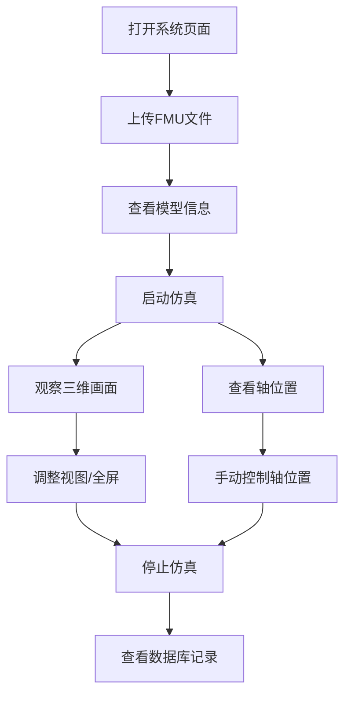
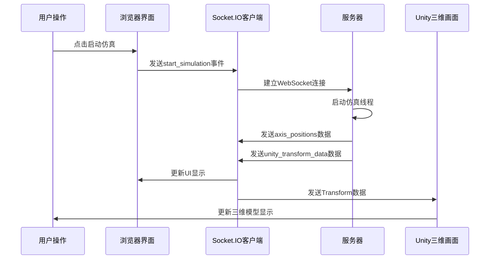

## 五轴数控机床仿真系统界面说明报告

### 1. 系统概述

本系统是一个基于Web浏览器的五轴数控机床仿真平台，主要用于在虚拟环境中对机床运动进行可视化展示和数据分析。系统支持FMU模型文件的加载与运行，提供实时三维可视化界面，并具备数据记录、外部数据源接入等扩展功能。

系统采用B/S架构，用户通过浏览器访问，无需安装客户端软件。界面采用响应式设计，适配不同尺寸的显示设备。

### 2. 界面布局结构

系统界面采用三区域布局结构，具体如下：

#### 2.1 顶部菜单栏
菜单栏位于页面顶部，固定显示，包含以下主要功能模块：
- **文件**：提供FMU文件上传、项目打开、配置保存、数据导出等功能
- **工具**：刀具管理、夹具管理等辅助工具入口
- **仿真**：仿真启动、停止、暂停、重置等控制操作
- **控制**：轴位置监控、手动控制、速度设置、3D视图控制等功能入口
- **数据**：数据库概览、会话统计、外部数据源、变量信息等数据相关功能
- **视图**：侧边栏切换、3D视图全屏、UI显示控制等界面调整选项
- **帮助**：系统日志、设置、帮助文档等辅助功能

#### 2.2 左侧边栏
侧边栏位于页面左侧，可折叠收起，包含两个主要部分：

**机床部件树**：以树形结构展示机床的组成部分，包括：
- 工作台组件（工作台底座、X/Y轴移动平台、C轴转台、工件）
- 主轴组件（主轴底座、Z轴主轴、A轴摆头、主轴电机、刀具、刀尖位置）
- 机床框架（立柱、底座、防护罩）

**状态监控**：实时显示系统运行状态：
- 连接状态指示器（已连接/未连接）
- 仿真状态指示器（运行中/已停止）
- 运行时间显示

#### 2.3 主内容区域
主内容区域占据页面右侧，分为上下两部分：

**上半部分 - 三维可视化区域**：
- 显示Unity WebGL渲染的机床三维模型
- 支持全屏显示、视角切换、显示比例调整（方形/16:9）
- 提供连接状态和仿真状态指示

**下半部分 - 功能标签页**：
包含九个主要功能标签页，具体功能见后续章节说明。

### 3. 主要功能模块说明

#### 3.1 FMU文件管理
**功能描述**：用于上传和管理FMU（Functional Mock-up Unit）模型文件。

**操作流程**：
1. 点击"选择FMU文件"按钮，浏览本地文件系统
2. 选择扩展名为.fmu的文件
3. 点击"上传并加载"按钮提交
4. 系统自动解析模型并显示模型信息

**显示内容**：
- 模型基本信息（名称、描述、变量总数）
- 输入变量列表（变量名、类型、因果关系、可变性、描述）
- 输出变量列表（同上）

#### 3.2 轴位置监控
**功能描述**：实时显示五轴机床各轴的位置信息。

**显示内容**：
- X轴位置（单位：毫米，mm）
- Y轴位置（单位：毫米，mm）
- Z轴位置（单位：毫米，mm）
- A轴位置（单位：度，°）
- C轴位置（单位：度，°）
- 仿真时间（单位：秒，s）

所有数值以固定小数位数显示，便于观察微小变化。

#### 3.3 仿真控制
**功能描述**：控制仿真的启动、停止等基本操作。

**控制按钮**：
- **启动仿真**：初始化并开始运行仿真计算，按钮变为禁用状态
- **停止仿真**：终止当前仿真运行，按钮变为禁用状态

**状态显示**：
- 仿真时间实时更新
- 状态指示灯颜色变化（运行中为蓝色，停止为灰色）
- 按钮可用性根据仿真状态自动调整

#### 3.4 变量信息
**功能描述**：展示FMU模型中定义的输入和输出变量详细信息。

**显示方式**：
- 左侧面板显示输入变量列表
- 右侧面板显示输出变量列表
- 每个变量显示名称、类型、因果关系、可变性等属性
- 包含变量描述信息的变量会额外显示描述文本

#### 3.5 手动控制
**功能描述**：允许用户手动指定某个轴的目标位置并执行移动操作。

**操作步骤**：
1. 在"选择轴"下拉菜单中选择目标轴（X/Y/Z/A/C）
2. 在"目标位置"输入框中输入数值
3. 点击"移动"按钮执行移动命令
4. 点击"停止"按钮可中断当前轴的运动

**速度设置**：
- 通过滑块调节仿真速度倍数（范围：0.1x - 5.0x）
- 实时显示当前速度值
- 点击"设置速度"按钮应用速度设置

#### 3.6 数据库概览
**功能描述**：展示系统记录的仿真数据统计和历史信息。

**显示内容**：

**当前位置卡片**：
- 显示最新记录的各轴位置和速度
- 包含时间戳信息
- 支持手动刷新获取最新数据

**最近会话表格**：
- 显示最近的仿真会话列表（最多50条）
- 包含会话ID、名称、状态、开始时间、总时长等信息
- 点击"统计"按钮可查看该会话的详细统计信息

**会话统计面板**：
- 记录总数、指令总数
- 完成指令数、失败指令数
- 开始时间、结束时间、持续时长

#### 3.7 外部数据源
**功能描述**：允许系统接收来自外部设备或系统的实时位置数据，用于将真实设备数据可视化展示。

**连接方式**：
1. 在"WebSocket地址"输入框中输入外部数据源的WebSocket地址（格式：ws://IP地址:端口/路径 或 wss://...）
2. 点击"连接"按钮建立连接
3. 连接成功后，状态指示器变为绿色，显示"已连接"
4. 系统自动切换到外部数据模式，停止内部仿真计算
5. 点击"断开"按钮可终止连接

**数据格式**：系统支持两种数据格式：
- 扁平格式：`{"X": 1.0, "Y": 2.0, "Z": 3.0, "A": 4.0, "C": 5.0}`
- 嵌套格式：`{"x": {"pos_cmd": 1.0, "vel_cmd": 0.1}, ...}`

#### 3.8 系统日志
**功能描述**：记录系统运行过程中的重要事件和操作信息。

**显示特点**：
- 终端风格的黑色背景、绿色文字显示
- 每条日志包含时间戳和消息内容
- 不同级别的日志使用不同颜色标识（成功：绿色，错误：红色，警告：橙色）
- 自动滚动到最新日志
- 支持"清除日志"功能清空当前显示内容

#### 3.9 测试功能
**功能描述**：预留的测试接口，用于功能验证和调试。

### 4. 三维可视化功能

#### 4.1 视图控制
系统提供多种视图控制选项：

**全屏显示**：
- 点击"全屏"按钮或按F11键进入全屏模式
- 全屏模式下按Esc键退出
- 全屏时Unity画布占据整个屏幕，提供更好的观察体验

**视角切换**：
- 通过"选择视角"下拉菜单可在多个预设视角间切换
- 视角切换由Unity端的CameraSwitcher组件实现

**显示比例调整**：
- 支持"方形"（1:1）和"16:9"两种显示比例
- 可通过按钮或菜单项切换

**UI显示控制**：
- "切换UI"按钮可控制Unity内部UI元素的显示/隐藏
- 用于在观察模型时减少界面元素干扰

#### 4.2 数据驱动机制
三维模型的运动由以下数据驱动：

**内部仿真模式**：
- 系统根据FMU模型计算各轴位置
- 将位置数据转换为Unity Transform数据（位置、旋转、缩放）
- 通过WebSocket实时推送至浏览器端
- Unity Integration模块接收数据并更新模型姿态

**外部数据模式**：
- 外部数据源通过WebSocket发送位置数据
- 浏览器端转发至服务器
- 服务器解析并广播到所有客户端
- Unity同样接收并更新模型

### 5. 交互流程说明

#### 5.1 基本使用流程

系统的基本使用流程如下：

#### 5.2 数据通信流程

系统采用Socket.IO实现浏览器与服务器的实时双向通信：

### 6. 快捷键与操作提示

#### 6.1 键盘快捷键
- **F11**：切换全屏模式（进入/退出）
- **Esc**：退出全屏模式（仅在全屏状态下有效）

#### 6.2 状态指示说明
系统在多个位置提供状态指示：

**连接状态指示器**：
- 绿色圆点：已连接到服务器
- 红色圆点：未连接到服务器

**仿真状态指示器**：
- 蓝色圆点：仿真运行中
- 灰色圆点：仿真已停止

**位置显示**：
- 所有轴位置数值实时更新
- 数值格式：线性轴显示为毫米（mm），保留4位小数
- 旋转轴显示为度（°），保留4位小数

### 7. 功能对照表

| 功能区域 | 主要操作 | 功能说明 | 适用场景 |
|---------|---------|---------|---------|
| 菜单-文件 | 上传FMU文件 | 加载仿真模型文件 | 首次使用或更换模型 |
| 菜单-仿真 | 启动/停止仿真 | 控制仿真运行状态 | 开始或结束仿真实验 |
| 菜单-控制 | 轴位置监控 | 查看实时位置数据 | 观察轴运动状态 |
| 菜单-控制 | 手动控制 | 指定轴位置并移动 | 测试特定轴动作 |
| 菜单-数据 | 数据库概览 | 查看历史数据记录 | 数据分析与回顾 |
| 菜单-数据 | 外部数据源 | 接入外部实时数据 | 真实设备数据可视化 |
| 菜单-视图 | 3D视图全屏 | 全屏显示三维画面 | 详细观察模型运动 |
| 菜单-视图 | 切换侧边栏 | 显示/隐藏侧边栏 | 调整界面布局 |
| 三维视图区 | 切换视角 | 改变观察角度 | 从不同角度观察模型 |
| 三维视图区 | 调整显示比例 | 改变画布比例 | 适配不同显示需求 |

### 8. 常见问题处理

#### 8.1 三维画面无法显示
**可能原因**：
- Unity WebGL文件加载失败
- 网络连接问题
- 浏览器兼容性问题

**解决方法**：
- 等待数秒，观察加载进度指示
- 检查网络连接状态
- 刷新页面重新加载
- 确认浏览器支持WebGL（Chrome、Firefox、Edge等现代浏览器）

#### 8.2 FMU文件上传失败
**可能原因**：
- 文件格式不正确
- 文件损坏
- 服务器处理超时

**解决方法**：
- 确认文件扩展名为.fmu
- 检查文件完整性
- 尝试重新上传
- 查看系统日志了解详细错误信息

#### 8.3 外部数据源连接失败
**可能原因**：
- WebSocket地址格式错误
- 目标服务器不可达
- 网络防火墙阻止连接

**解决方法**：
- 确认地址格式为ws://或wss://开头
- 检查目标服务器是否运行
- 验证网络连接和防火墙设置
- 查看浏览器控制台错误信息

#### 8.4 轴位置数值跳动过快
**解决方法**：
- 降低仿真速度（调整速度滑块至较低值）
- 暂停或停止仿真，使用手动控制逐步移动
- 在轴位置监控页面观察数值变化

### 9. 术语说明

为便于理解，以下对报告中使用的专业术语进行说明：

**FMU（Functional Mock-up Unit）**：功能模拟单元，是一种标准化的模型文件格式，用于描述物理系统的数学模型。在本系统中，FMU文件包含机床的运动学模型。

**轴（Axis）**：指机床的运动自由度。本系统支持五轴：
- **X轴**、**Y轴**、**Z轴**：线性运动轴，分别对应机床的左右、前后、上下移动
- **A轴**：旋转轴，通常指主轴头的摆动角度
- **C轴**：旋转轴，通常指工作台的旋转角度

**WebSocket**：一种网络通信协议，支持浏览器与服务器之间的全双工实时通信。系统使用Socket.IO库实现WebSocket通信。

**外部数据模式**：当系统连接到外部数据源时，系统停止内部仿真计算，直接使用外部设备发送的实时位置数据驱动三维模型显示。

**Unity WebGL**：Unity引擎导出的Web版本，可在浏览器中运行三维交互应用。系统使用Unity WebGL实现三维可视化功能。

### 10. 总结

本系统界面设计遵循直观易用的原则，通过清晰的布局结构和丰富的功能模块，为用户提供了完整的机床仿真操作体验。系统支持模型加载、仿真控制、实时可视化、数据记录、外部数据接入等核心功能，能够满足教学演示、实验验证、数据分析等多种应用场景的需求。

通过合理的交互设计和状态反馈机制，用户可以便捷地完成从模型加载到数据查看的完整工作流程。系统采用Web技术实现，具有良好的跨平台兼容性和可扩展性。

