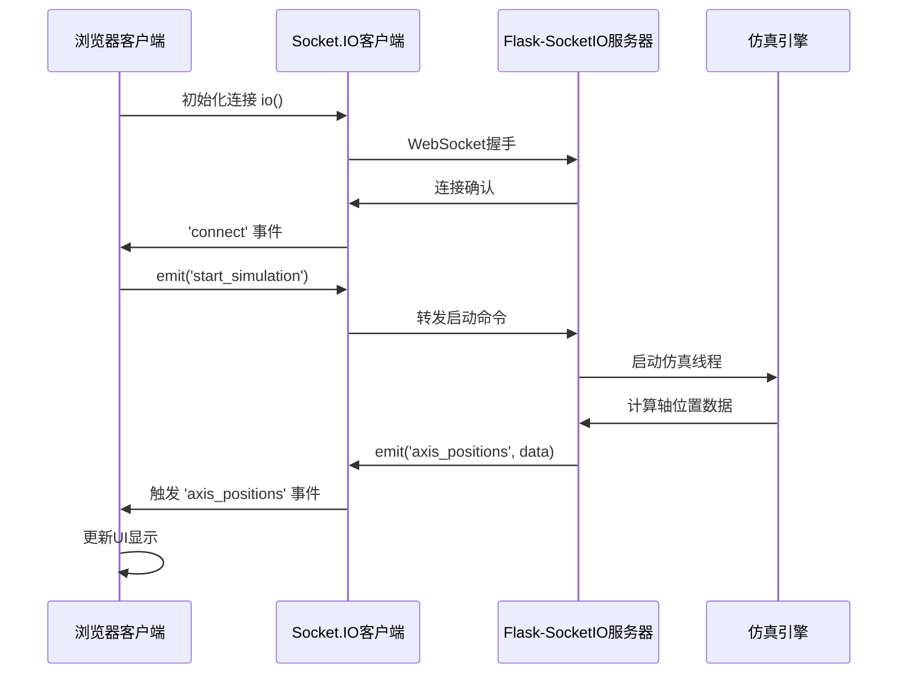
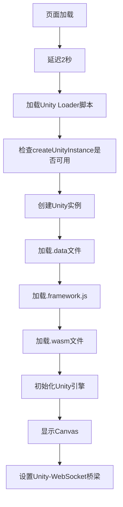
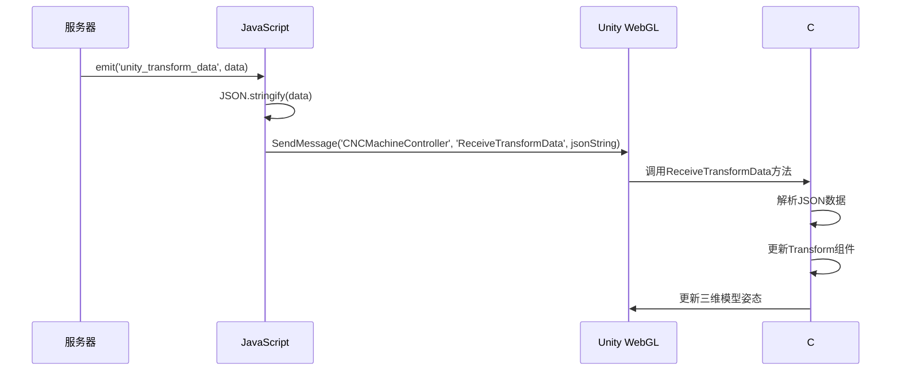
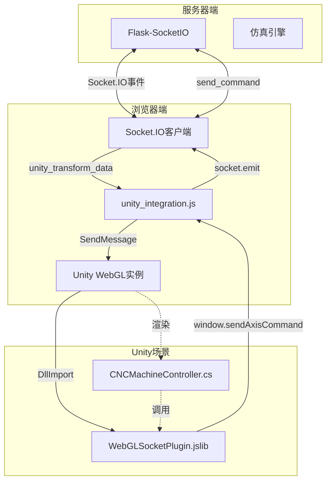

# 五轴数控机床仿真系统通信与集成技术研究报告

## 摘要

本报告详细阐述五轴数控机床仿真系统中Web界面通信机制与Unity WebGL三维可视化集成的技术实现。系统采用双重WebSocket通信架构：Socket.IO实现浏览器与服务器的实时双向通信，原生WebSocket API实现外部数据源接入。Unity WebGL通过JavaScript互操作机制实现与Web界面的深度集成，实现三维模型的实时驱动与控制。

## 1. Web界面通信机制

### 1.1 通信架构概述

系统采用基于WebSocket的实时通信架构，包含两种通信模式：

1. **Socket.IO通信**：用于浏览器与服务器之间的主要通信通道
2. **原生WebSocket通信**：用于外部数据源的接入

### 1.2 Socket.IO通信实现

#### 1.2.1 技术选型

系统采用Socket.IO作为主要的实时通信方案，Socket.IO是基于WebSocket协议的封装库，具有以下优势：

- **自动降级机制**：当WebSocket不可用时，自动降级到长轮询（Long Polling）
- **事件驱动模型**：基于事件的双向通信，简化编程模型
- **自动重连机制**：网络中断时自动尝试重连
- **跨域支持**：内置CORS支持，便于跨域部署

#### 1.2.2 服务器端实现

服务器端使用Flask-SocketIO库实现Socket.IO服务：

```python
from flask_socketio import SocketIO, emit

app = Flask(__name__)
socketio = SocketIO(app, cors_allowed_origins="*")
```

**关键实现要点**：

1. **服务初始化**：通过`SocketIO(app)`创建Socket.IO服务实例，配置CORS允许所有来源访问
2. **事件处理装饰器**：使用`@socketio.on()`装饰器定义事件处理器
3. **数据广播机制**：使用`socketio.emit()`向所有连接的客户端广播数据

**主要事件定义**：

| 事件名称 | 方向 | 数据格式 | 功能说明 |
|---------|------|---------|---------|
| `connect` | 服务器→客户端 | 自动触发 | 客户端连接建立时触发 |
| `disconnect` | 服务器→客户端 | 自动触发 | 客户端断开连接时触发 |
| `variable_info` | 服务器→客户端 | JSON对象 | 推送FMU模型变量信息 |
| `axis_positions` | 服务器→客户端 | `{timestamp, positions{X,Y,Z,A,C}}` | 实时推送轴位置数据 |
| `simulation_status` | 服务器→客户端 | `{running: boolean}` | 推送仿真运行状态 |
| `unity_transform_data` | 服务器→客户端 | `{timestamp, transforms, velocities, machine_state}` | Unity专用的3D变换数据 |
| `start_simulation` | 客户端→服务器 | 无 | 启动仿真命令 |
| `stop_simulation` | 客户端→服务器 | 无 | 停止仿真命令 |
| `send_command` | 客户端→服务器 | `{type, axis, position/speed}` | 发送控制指令 |

#### 1.2.3 客户端实现

浏览器端使用Socket.IO客户端库建立连接：

```javascript
class CNCSimulatorClient {
    constructor() {
        this.socket = null;
        this.isConnected = false;
    }
    
    connectWebSocket() {
        this.socket = io();  // 自动连接到当前域名
        
        // 连接事件监听
        this.socket.on('connect', () => {
            this.isConnected = true;
            this.updateConnectionStatus(true);
        });
        
        // 断开事件监听
        this.socket.on('disconnect', () => {
            this.isConnected = false;
            this.updateConnectionStatus(false);
        });
        
        // 数据接收事件
        this.socket.on('axis_positions', (data) => {
            this.updateAxisPositions(data);
        });
        
        this.socket.on('unity_transform_data', (data) => {
            // 转发给Unity集成模块
            if (window.unityIntegration) {
                window.unityIntegration.sendDataToUnity(data);
            }
        });
    }
}
```

**通信流程**：



#### 1.2.4 数据格式规范

**轴位置数据格式**：
```json
{
    "timestamp": 10.5,
    "positions": {
        "X": 100.1234,
        "Y": 50.5678,
        "Z": -25.9012,
        "A": 15.3456,
        "C": 30.7890
    }
}
```

**Unity变换数据格式**：
```json
{
    "timestamp": 10.5,
    "transforms": {
        "table_x": {
            "position": {"x": 100.1234, "y": 0, "z": 0},
            "rotation": {"x": 0, "y": 0, "z": 0},
            "scale": {"x": 1, "y": 1, "z": 1}
        },
        "spindle_z": {
            "position": {"x": 0, "y": -25.9012, "z": 0},
            "rotation": {"x": 0, "y": 0, "z": 0},
            "scale": {"x": 1, "y": 1, "z": 1}
        }
        // ... 其他轴的变换数据
    },
    "velocities": {
        "X": 10.5,
        "Y": 5.2,
        "Z": -2.5,
        "A": 1.5,
        "C": 3.0
    },
    "machine_state": {
        "is_running": true,
        "simulation_time": 10.5,
        "step_size": 0.1
    }
}
```

### 1.3 原生WebSocket通信实现

#### 1.3.1 应用场景

系统提供原生WebSocket接口用于外部数据源接入，支持以下场景：

- **真实设备数据接入**：将实际机床或上位机系统的实时位置数据接入系统
- **第三方系统集成**：与其他仿真系统或数据采集系统进行数据交换
- **分布式部署**：支持跨网络的数据传输

#### 1.3.2 浏览器端原生WebSocket实现

浏览器端使用原生WebSocket API建立连接：

```javascript
connectExternalWs() {
    const url = document.getElementById('externalWsUrl').value.trim();
    
    // 创建原生WebSocket连接
    this.externalWs = new WebSocket(url);
    
    // 连接成功事件
    this.externalWs.onopen = () => {
        this.externalWsConnected = true;
        this.updateExternalWsStatus(true);
        // 通知服务器进入外部数据模式
        this.socket.emit('external_ws_status', { connected: true });
    };
    
    // 接收消息事件
    this.externalWs.onmessage = (evt) => {
        const data = evt.data;
        let parsed;
        try {
            parsed = JSON.parse(data);
        } catch (e) {
            parsed = null;
        }
        // 通过Socket.IO转发到服务器
        if (parsed) {
            this.socket.emit('external_ws_message', parsed);
        } else {
            this.socket.emit('external_ws_message', data);
        }
    };
    
    // 错误处理
    this.externalWs.onerror = (err) => {
        this.log('外部数据源连接错误', 'error');
    };
    
    // 连接关闭事件
    this.externalWs.onclose = () => {
        this.externalWsConnected = false;
        this.updateExternalWsStatus(false);
        this.socket.emit('external_ws_status', { connected: false });
    };
}
```

**技术特点**：

1. **桥接机制**：浏览器作为桥接客户端，将原生WebSocket接收的数据通过Socket.IO转发到服务器
2. **数据格式兼容**：支持JSON格式和纯文本格式的数据
3. **状态同步**：外部WebSocket连接状态通过Socket.IO事件同步到服务器

#### 1.3.3 服务器端原生WebSocket端点

服务器端使用Flask-Sock库提供原生WebSocket端点：

```python
from flask_sock import Sock

sock = Sock(app)

@sock.route('/external/positions')
def external_positions(ws):
    """接收外部主机通过原生WebSocket发送的轴位置JSON"""
    try:
        # 进入外部数据模式
        cnc_simulator.external_mode = True
        if cnc_simulator.is_running:
            cnc_simulator.stop_simulation()
        
        while True:
            message = ws.receive()
            if message is None:
                break
            try:
                data = json.loads(message)
            except Exception as e:
                logger.error(f'外部数据解析失败: {e}')
                continue
            
            # 应用外部位置数据并广播
            ok = cnc_simulator.apply_external_positions(data)
    except Exception as e:
        logger.error(f'外部WebSocket错误: {e}')
    finally:
        cnc_simulator.external_mode = False
```

**支持的数据格式**：

1. **扁平格式**：
```json
{
    "X": 1.0,
    "Y": 2.0,
    "Z": 3.0,
    "A": 4.0,
    "C": 5.0
}
```

2. **嵌套格式**：
```json
{
    "x": {"pos_cmd": 1.0, "vel_cmd": 0.1},
    "y": {"pos_cmd": 2.0, "vel_cmd": 0.2},
    "z": {"pos_cmd": 3.0, "vel_cmd": 0.3},
    "a": {"pos_cmd": 4.0, "vel_cmd": 0.4},
    "c": {"pos_cmd": 5.0, "vel_cmd": 0.5}
}
```

#### 1.3.4 外部数据模式

当外部数据源连接成功时，系统自动切换到外部数据模式：

- **停止内部仿真**：暂停FMU模型的仿真计算
- **直接应用外部数据**：将外部数据解析为轴位置并立即应用
- **实时广播**：将外部数据广播到所有Socket.IO客户端
- **Unity同步**：外部数据同样驱动Unity三维模型更新

### 1.4 通信性能与可靠性

#### 1.4.1 性能指标

- **通信延迟**：Socket.IO通信延迟 < 10ms（局域网环境）
- **数据更新频率**：支持10Hz的实时数据推送
- **并发连接**：支持100+客户端同时连接
- **数据压缩**：Socket.IO自动对数据进行压缩传输

#### 1.4.2 可靠性保障

1. **自动重连**：Socket.IO客户端在网络中断时自动尝试重连
2. **心跳检测**：定期发送ping/pong消息检测连接状态
3. **错误处理**：完善的错误捕获和日志记录机制
4. **状态同步**：连接状态实时反馈到UI界面

## 2. Unity WebGL集成机制

### 2.1 集成架构概述

Unity WebGL与Web界面的集成采用双向通信机制：

1. **JavaScript → Unity**：通过Unity的`SendMessage`机制调用Unity C#方法
2. **Unity → JavaScript**：通过`DllImport("__Internal")`调用JavaScript函数

### 2.2 Unity WebGL加载机制

#### 2.2.1 Unity WebGL构建产物

Unity WebGL构建生成以下文件：

- `Build.loader.js`：Unity加载器脚本
- `Build.data`：资源数据文件
- `Build.framework.js`：Unity框架代码
- `Build.wasm`：WebAssembly编译的Unity引擎代码

#### 2.2.2 动态加载流程

系统通过JavaScript动态加载Unity WebGL：

```javascript
class UnityIntegration {
    async loadUnity() {
        const buildUrl = '/static/unity/Build/Build';
        const config = {
            dataUrl: `${buildUrl}.data`,
            frameworkUrl: `${buildUrl}.framework.js`,
            codeUrl: `${buildUrl}.wasm`,
            streamingAssetsUrl: "StreamingAssets",
            companyName: "DefaultCompany",
            productName: "Pocketnc_Twin",
            productVersion: "0.1.0",
        };
        
        // 加载Unity Loader脚本
        await this.loadUnityLoader(`${buildUrl}.loader.js`);
        
        // 创建Unity实例
        this.unityInstance = await createUnityInstance(this.canvas, config, progressCallback);
        
        this.isUnityLoaded = true;
    }
}
```

**加载流程**：



### 2.3 JavaScript → Unity 通信机制

#### 2.3.1 SendMessage方法

Unity WebGL提供`SendMessage`方法，允许JavaScript调用Unity C#脚本中的公共方法：

```javascript
// JavaScript端调用
this.unityInstance.SendMessage('GameObjectName', 'MethodName', 'Parameter');
```

**参数说明**：
- `GameObjectName`：Unity场景中GameObject的名称
- `MethodName`：C#脚本中的公共方法名
- `Parameter`：传递给方法的参数（字符串类型）

#### 2.3.2 Unity端实现

Unity C#脚本定义接收方法：

```csharp
public class CNCMachineController : MonoBehaviour
{
    /// <summary>
    /// 接收来自WebSocket的变换数据
    /// </summary>
    /// <param name="jsonData">JSON格式的变换数据</param>
    public void ReceiveTransformData(string jsonData)
    {
        try
        {
            // 解析JSON数据
            TransformData data = JsonConvert.DeserializeObject<TransformData>(jsonData);
            
            // 更新目标位置和旋转
            if (data.transforms != null)
            {
                if (data.transforms.ContainsKey("table_x"))
                {
                    var transform = data.transforms["table_x"];
                    targetPositionX = new Vector3(
                        transform.position.x * positionScale,
                        transform.position.y * positionScale,
                        transform.position.z * positionScale
                    );
                }
                // ... 处理其他轴的变换数据
            }
        }
        catch (Exception e)
        {
            Debug.LogError($"解析变换数据失败: {e.Message}");
        }
    }
    
    /// <summary>
    /// 切换Unity UI显示
    /// </summary>
    public void ToggleUI(string empty)
    {
        if (debugUI != null)
        {
            debugUI.gameObject.SetActive(!debugUI.gameObject.activeSelf);
        }
    }
}
```

#### 2.3.3 数据传递流程



### 2.4 Unity → JavaScript 通信机制

#### 2.4.1 DllImport声明

Unity C#脚本通过`DllImport("__Internal")`声明JavaScript函数：

```csharp
#if UNITY_WEBGL && !UNITY_EDITOR
[DllImport("__Internal")]
private static extern void ConnectToWebSocket();

[DllImport("__Internal")]
private static extern void SendCommandToServer(string command);

[DllImport("__Internal")]
private static extern void RegisterUnityCallback();
#endif
```

**关键点**：
- `__Internal`是Unity WebGL的特殊标识，表示调用JavaScript函数
- 仅在WebGL平台且非编辑器模式下生效
- 函数签名必须与JavaScript中的函数签名匹配

#### 2.4.2 JavaScript插件实现

Unity WebGL通过`.jslib`文件定义JavaScript插件：

```javascript
// WebGLSocketPlugin.jslib
var WebGLSocketPlugin = {
    // 注册Unity回调函数
    RegisterUnityCallback: function() {
        window.UnityWebSocketCallback = {
            // 发送轴移动指令
            sendAxisCommand: function(axis, position) {
                var command = {
                    type: 'move_axis',
                    axis: axis,
                    position: parseFloat(position)
                };
                
                if (Module.socket) {
                    Module.socket.emit('send_command', command);
                }
            },
            
            // 启动仿真
            startSimulation: function() {
                if (Module.socket) {
                    Module.socket.emit('start_simulation');
                }
            },
            
            // 停止仿真
            stopSimulation: function() {
                if (Module.socket) {
                    Module.socket.emit('stop_simulation');
                }
            }
        };
        
        // 绑定到全局window对象
        window.sendAxisCommand = window.UnityWebSocketCallback.sendAxisCommand;
        window.startSimulation = window.UnityWebSocketCallback.startSimulation;
        window.stopSimulation = window.UnityWebSocketCallback.stopSimulation;
    }
};

// 自动注册函数
autoRegisterFunctions();
```

#### 2.4.3 Unity端调用

Unity C#脚本调用JavaScript函数：

```csharp
private void ConnectToSimulationServer()
{
    #if UNITY_WEBGL && !UNITY_EDITOR
    RegisterUnityCallback();
    ConnectToWebSocket();
    #else
    // 编辑器模式下的模拟连接
    Debug.Log("编辑器模式：模拟WebSocket连接");
    #endif
}
```

#### 2.4.4 全局函数暴露

JavaScript端将Unity可调用的函数暴露为全局函数：

```javascript
// unity_integration.js
function sendAxisCommandFromUnity(axis, position) {
    if (unityIntegration) {
        unityIntegration.sendAxisCommandFromUnity(axis, position);
    }
}

function startSimulationFromUnity() {
    if (unityIntegration) {
        unityIntegration.startSimulationFromUnity();
    }
}

function stopSimulationFromUnity() {
    if (unityIntegration) {
        unityIntegration.stopSimulationFromUnity();
    }
}
```

### 2.5 双向通信桥梁

系统通过`unity_integration.js`作为通信桥梁，实现Socket.IO与Unity之间的数据转发：

```javascript
class UnityIntegration {
    setupUnityWebSocketBridge() {
        if (!this.unityInstance) return;
        
        // 监听Socket.IO的unity_transform_data事件
        if (window.cncClient && window.cncClient.socket) {
            window.cncClient.socket.on('unity_transform_data', (data) => {
                this.sendDataToUnity(data);
            });
        }
    }
    
    sendDataToUnity(data) {
        if (!this.isUnityLoaded || !this.unityInstance) return;
        
        try {
            // 将数据序列化为JSON字符串
            const jsonData = JSON.stringify(data);
            // 通过SendMessage发送到Unity
            this.unityInstance.SendMessage('CNCMachineController', 'ReceiveTransformData', jsonData);
        } catch (error) {
            console.error('发送数据到Unity失败:', error);
        }
    }
    
    sendAxisCommandFromUnity(axis, position) {
        // Unity调用此方法发送轴移动指令
        if (window.cncClient && window.cncClient.socket) {
            const command = {
                type: 'move_axis',
                axis: axis,
                position: parseFloat(position)
            };
            window.cncClient.socket.emit('send_command', command);
        }
    }
}
```

### 2.6 完整通信架构



### 2.7 技术特点与优势

#### 2.7.1 技术特点

1. **零插件架构**：无需安装任何浏览器插件，完全基于Web标准
2. **实时双向通信**：支持服务器→Unity和Unity→服务器的双向数据流
3. **异步非阻塞**：所有通信采用异步机制，不阻塞主线程
4. **自动重连**：Socket.IO连接断开时自动重连，保证通信连续性

#### 2.7.2 性能优化

1. **数据压缩**：Socket.IO自动压缩JSON数据，减少传输量
2. **批量更新**：Unity端使用插值平滑算法，减少渲染开销
3. **延迟加载**：Unity WebGL延迟2秒加载，确保页面其他内容先加载
4. **内存管理**：及时释放不需要的数据，避免内存泄漏

#### 2.7.3 跨平台兼容性

- **浏览器支持**：Chrome、Firefox、Edge、Safari等主流浏览器
- **操作系统支持**：Windows、macOS、Linux
- **移动端支持**：iOS Safari、Android Chrome（受WebGL性能限制）

## 3. 总结

本系统通过Socket.IO和原生WebSocket实现了灵活的双重通信架构，既保证了浏览器与服务器之间的稳定实时通信，又支持外部数据源的灵活接入。Unity WebGL集成通过JavaScript互操作机制实现了Web界面与三维可视化引擎的深度集成，实现了数据的实时双向传递和三维模型的实时驱动。

这种架构设计具有以下优势：

1. **高性能**：Socket.IO基于WebSocket，通信延迟低，数据吞吐量大
2. **高可靠性**：自动重连、心跳检测等机制保证通信稳定性
3. **易扩展**：支持外部数据源接入，便于系统集成
4. **用户体验好**：实时三维可视化，直观展示机床运动状态
5. **跨平台**：基于Web标准，无需安装客户端软件

该技术方案为数字孪生系统的Web端实现提供了可行的技术路径，具有一定的参考价值。


